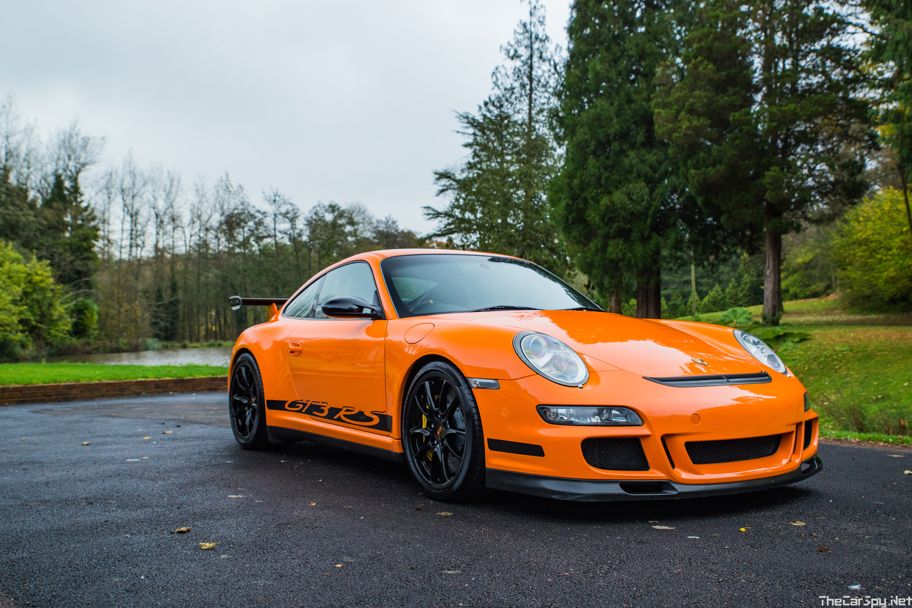

# Porsche 911 GT3 RS: The Ultimate Track-Focused Icon

## Introduction

The **Porsche 911 GT3 RS** represents the pinnacle of Porsche's commitment to high-performance, track-oriented sports cars. As a homologation special, it bridges the gap between road-legal vehicles and pure racing machines. Known for its naturally aspirated flat-six engine, lightweight construction, and exceptional handling, the GT3 RS has become a legend among enthusiasts and racers alike. Since its debut in 2003, it has evolved through multiple generations, each pushing the boundaries of performance and aerodynamics.

## History and Evolution

The GT3 RS lineage began with the **996-generation GT3 RS** in 2003, inspired by Porsche's racing heritage, including the iconic Carrera 2.7 RS from the 1970s. It featured distinctive blue or red wheels and "GT3 RS" side stickers, emphasizing its racing pedigree. This model was not sold in the US or Canada, with only 682 units produced.

The **997-generation** brought significant updates, including a wider rear track and improved aerodynamics. The 997.1 GT3 RS (2006-2009) weighed 1,370 kg and produced 331 kW (450 PS). The 997.2 GT3 RS (2009-2011) increased power to 331 kW (450 PS), and the pinnacle 997.2 GT3 RS 4.0 (2011) delivered 368 kW (500 PS) with a 4.0-liter engine, limited to 600 units.

The **991-generation** marked a new era with the 991.1 GT3 RS (2015-2017) featuring a 4.0-liter engine producing 368 kW (500 PS) and a top speed of 310 km/h. The 991.2 GT3 RS (2018-2019) boosted power to 382 kW (520 PS) and achieved a Nürburgring lap time of 6:56.4 minutes, the fastest by a production car at the time.

The latest **992-generation GT3 RS** (2022-present) generates 386 kW (525 PS) and 465 N⋅m of torque, with 860 kg of downforce at 285 km/h. It set a Nürburgring record of 6:44.848 minutes in 2022.

## Engine and Performance

At the heart of every GT3 RS is a **naturally aspirated flat-six engine**, a hallmark of Porsche's engineering. The latest 992 GT3 RS uses a 4.0-liter unit producing 386 kW (525 PS) at 8,500 rpm and 465 N⋅m of torque at 6,300 rpm, with a redline of 9,000 rpm.

Key performance figures:
- **0-100 km/h**: 3.2 seconds
- **Top Speed**: 296 km/h
- **Power-to-Weight Ratio**: Exceptional, thanks to weights ranging from 1,360 kg (997 RS 4.0) to 1,450 kg (992 RS)

The engine's design prioritizes high-revving performance, with titanium connecting rods and advanced fuel injection for optimal efficiency and power delivery.

## Design and Aerodynamics

The GT3 RS is engineered for the track, with aerodynamics playing a crucial role. The latest model generates up to 860 kg of downforce at high speeds, ensuring stability and grip.

Exterior features include:
- **Active Rear Wing**: Adjustable for different driving conditions
- **NACA Ducts**: For brake cooling
- **Wider Body**: Increased track width for better handling
- **Lightweight Materials**: Carbon fiber hood, rear wing, and other components

The design emphasizes functionality over aesthetics, with subtle cues like the "GT3 RS" badging and sporty exhaust tips.

## Interior and Features

Inside, the GT3 RS is stripped for performance. The cabin features:
- **Full Bucket Seats**: Based on the 918 Spyder's carbon seats
- **Carbon Fiber Trim**: Lightweight and durable
- **Minimalist Dashboard**: Focused on driving essentials
- **PDK Transmission**: Seven-speed dual-clutch for lightning-fast shifts
- **Advanced Electronics**: Including Porsche Torque Vectoring Plus and rear-wheel steering

Safety features include a bolted roll cage and six-point harnesses, making it ready for track use out of the box.

## Variants

While primarily a coupe, some generations offered convertible versions. The GT3 RS is available in various colors, with special editions like the Weissach package adding magnesium wheels and more carbon fiber.

## Racing Heritage

The GT3 RS has dominated motorsport:
- **Porsche Supercup**: Supports Formula 1, with GT3 Cup cars
- **GT3 Series**: Customer racing with dedicated GT3 R versions
- **Endurance Racing**: Victories at Le Mans, Nürburgring, and more
- **Records**: Fastest naturally aspirated production car lap at Nürburgring (992 RS: 6:44.848)

It has won numerous championships and set benchmarks for performance cars.

## Specifications

| Generation | Years | Engine | Power | Torque | Weight | 0-100 km/h | Top Speed |
|------------|-------|--------|-------|--------|--------|------------|-----------|
| 996 GT3 RS | 2003-2004 | 3.6L Flat-6 | 280 kW (381 PS) | 385 N⋅m | 1,360 kg | 4.4 s | 306 km/h |
| 997.1 GT3 RS | 2006-2009 | 3.6L Flat-6 | 305 kW (415 PS) | 405 N⋅m | 1,375 kg | 4.2 s | 310 km/h |
| 997.2 GT3 RS | 2009-2011 | 3.8L Flat-6 | 331 kW (450 PS) | 430 N⋅m | 1,370 kg | 4.0 s | 310 km/h |
| 997.2 GT3 RS 4.0 | 2011 | 4.0L Flat-6 | 368 kW (500 PS) | 460 N⋅m | 1,360 kg | 3.9 s | 310 km/h |
| 991.1 GT3 RS | 2015-2017 | 4.0L Flat-6 | 368 kW (500 PS) | 460 N⋅m | 1,420 kg | 3.3 s | 310 km/h |
| 991.2 GT3 RS | 2018-2019 | 4.0L Flat-6 | 382 kW (520 PS) | 470 N⋅m | 1,430 kg | 3.2 s | 312 km/h |
| 992 GT3 RS | 2022-present | 4.0L Flat-6 | 386 kW (525 PS) | 465 N⋅m | 1,450 kg | 3.2 s | 296 km/h |

## Conclusion

The Porsche 911 GT3 RS is more than a car—it's a statement of engineering excellence and racing passion. Each generation builds on the last, offering unparalleled performance for the track while remaining road-legal. Whether you're a collector, racer, or enthusiast, the GT3 RS embodies the spirit of Porsche: innovation, precision, and thrill.

For more details, visit the [Porsche official site](https://www.porsche.com) or [Wikipedia page](https://en.wikipedia.org/wiki/Porsche_911_GT3).

## Image credits

- `assets/images/Ritik/porsche_996_gt3_rs_exfordy.jpg` — Brian Snelson (exfordy) / CC BY 2.0 (via Flickr, via Wikimedia Commons)
- `assets/images/Ritik/gt3_rs_997_front.jpg` — The Car Spy / CC BY 2.0 (via Flickr, via Wikimedia Commons)
- `assets/images/Ritik/gt3_rs_991_rear.jpg` — Mr.choppers / CC BY-SA 3.0 (via Wikimedia Commons)
- `assets/images/Ritik/geneva_2018_gt3_rs.jpg` — Matti Blume / CC BY-SA 4.0 (via Wikimedia Commons)